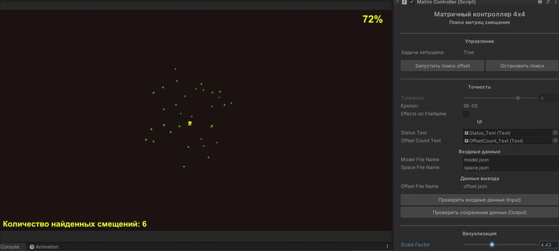

# Unity Matrix Solution

## Description
Test project that works with matrices (4x4), visualizes process and finds a set of matrices (offsets) for the set of matrices (model) such that the result set is completely contained in the set of matrices (space) following next condition:

The sets of matrices are provided as JSON.

## Installation of the project

Clone git repository or simply download files placing them in your local folder.

## Usage

### JSON Files
In project you can find the folder named `JSON_Storage`. The folder contains Input JSON files (model, space) and the Output folder, where found offsets are saved and stored.

### Controls
On the scene you can find object Martix Controller with `MatrixController` component on it. This object works with files, manages and controls the process. 

It has custom inspector view and some controlls, so you can do it automatically or take part in the process. (You can find more information in the documentation file).

### Process of founding offsets

To start founding offsets simply hit Play Button and it will run automatically or control it by yourself with `MatrixController's` custom inspector.
 
### Results

When the process is done, it will create `offset.json` file in the Output storage.