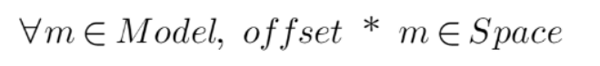

# Unity Matrix Solution

## Description
Test project that works with matrices (4x4), visualizes and finds a set of matrices (offsets) for the set of matrices (model) such that the result set is completely contained in the set of matrices (space) following next condition: offset•model=space. The set of matrices is provided as JSON.

## Installation of the project

Clone git repository or straight download files placing them in your local folder.

### Notes: 
- Don't forget to use Internet connection to correctly handle dependencies.
- Don't forget to open relevant scene `Matrix_Scene` (and/or add it to the Scenes in build settings).

## Usage

### JSON Files
In project you can find the folder named `JSON_Storage`. The folder contains Input JSON files (model, space) and the Output folder, where found offsets are saved and stored.

### Components
On the scene you can find object Martix Controller with `MatrixController` component on it. That object works with Files, manage and controls process. 

It has custom inspector view on it and some controlls, so you can do it automatically or take part in this process. (If controls are not obvious enough, you can find more information in the documentation file).

### Process of founding offsets

To start founding offsets simply hit Play Button and it will run automatically or control it by yourself with `MatrixController` custom inspector.
 
### Results

When process is done, it will create `offset.json` file in Output storage.